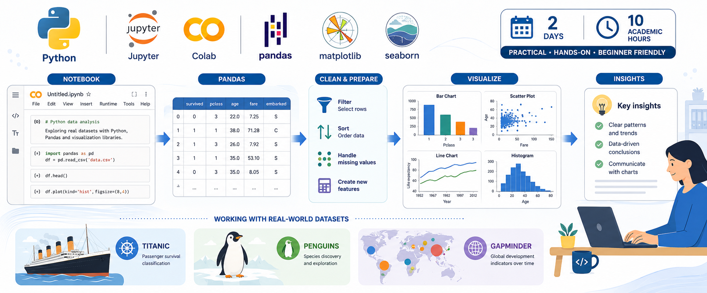

# Python datu analīzes un vizualizācijas kurss

Divu dienu, 10 akadēmisko stundu praktisks kurss pieaugušiem iesācējiem par datu analīzi ar Python, Pandas, Matplotlib, Seaborn un Google Colab.

Kurss ir paredzēts cilvēkiem ar nelielu programmēšanas pieredzi vai bez tās. Excel pieredze ir noderīga, bet nav obligāta.

Angļu versija: [README_en.md](README_en.md)



## Termini

Daži kursā lietotie termini bieži tiek lietoti arī angliski:

- piezīmju grāmata (ang. notebook)
- šūna (ang. cell)
- koda šūna (ang. code cell)
- Markdown šūna jeb teksta šūna (ang. Markdown cell)
- izpildes vide (ang. runtime)
- Pandas datu tabula jeb DataFrame (ang. DataFrame)
- reproducējama analīze (ang. reproducible analysis)

## Sāciet šeit

Ja šī ir jūsu pirmā vizīte:

1. Atveriet 1. dienas ievada piezīmju grāmatu Google Colab.
2. Pierakstieties ar Google kontu, ja Colab to prasa.
3. Nodarbības laikā palaidiet šūnas pa vienai un pēc katra soļa apskatiet rezultātu.
4. Komandu **Runtime > Run all** izmantojiet vēlāk, kad vēlaties pārbaudīt, vai visa piezīmju grāmata darbojas no sākuma līdz beigām.

Ja mācības notiek latviski, sāciet ar latviešu 1. dienas ievada piezīmju grāmatu.

## Kas nepieciešams

- Tīmekļa pārlūkprogramma
- Google konts darbam ar Google Colab
- Nav nepieciešams lokāli instalēt Python
- Nav nepieciešama iepriekšēja programmēšanas pieredze
- Gatavība uzmanīgi lasīt tabulas, diagrammas un īsus koda piemērus

## Par ko ir šis kurss

Kursā tiks praktizēta reproducējama datu analīzes darba plūsma:

```text
Atvērt piezīmju grāmatu -> Ielādēt datus -> Apskatīt tabulu
-> Novērst vienkāršas datu problēmas -> Filtrēt un apkopot
-> Izveidot diagrammas -> Uzrakstīt secinājumus
```

Galvenais uzsvars ir praktiska analīze, nevis programmatūras izstrāde. Piezīmju grāmatās ir īsas koda šūnas, redzami rezultāti, salīdzinājumi ar Excel un jautājumi rezultātu interpretēšanai.

## Kuru piezīmju grāmatu atvērt?

| Situācija | Piezīmju grāmata | Atvērt Colab |
| --- | --- | --- |
| Es sāku 1. dienu latviski | `notebooks/day_1/01_python_jupyter_notebook_basics_lv.ipynb` | [](https://colab.research.google.com/github/ValRCS/RTU_Python_Data_Analysis_Visualization_May_2026/blob/main/notebooks/day_1/01_python_jupyter_notebook_basics_lv.ipynb) |
| Es vēlos 1. dienas ievadu angliski | `notebooks/day_1/01_python_jupyter_notebook_basics.ipynb` | [](https://colab.research.google.com/github/ValRCS/RTU_Python_Data_Analysis_Visualization_May_2026/blob/main/notebooks/day_1/01_python_jupyter_notebook_basics.ipynb) |
| Es jau saprotu piezīmju grāmatu pamatus | `notebooks/day_1/01_day1_titanic_data_analysis.ipynb` | [](https://colab.research.google.com/github/ValRCS/RTU_Python_Data_Analysis_Visualization_May_2026/blob/main/notebooks/day_1/01_day1_titanic_data_analysis.ipynb) |
| Es sāku 2. dienu | `notebooks/day_2/02_day2_penguins_visualization_storytelling.ipynb` | [](https://colab.research.google.com/github/ValRCS/RTU_Python_Data_Analysis_Visualization_May_2026/blob/main/notebooks/day_2/02_day2_penguins_visualization_storytelling.ipynb) |
| Es pabeidzu ātrāk vai vēlos papildu praksi | `notebooks/day_2/03_bonus_gapminder_visual_analysis.ipynb` | [](https://colab.research.google.com/github/ValRCS/RTU_Python_Data_Analysis_Visualization_May_2026/blob/main/notebooks/day_2/03_bonus_gapminder_visual_analysis.ipynb) |

1. dienas ievada piezīmju grāmatas ir īsākas un paredzētas pirmajām 1 līdz 2 akadēmiskajām stundām. Galvenās 1. un 2. dienas darba burtnīcas ir pilnas dienas materiāli ar pasniedzēja demonstrācijām, vadītu praksi, pārbaudes jautājumiem, maziem patstāvīgiem uzdevumiem, biežākajām kļūdām, refleksijas jautājumiem un īsu dienas noslēguma kopsavilkumu.

## Ko jūs iemācīsieties

Pēc divām galvenajām darba burtnīcām jums vajadzētu prast:

- atvērt un palaist Google Colab piezīmju grāmatu
- ielādēt CSV failu Pandas DataFrame tabulā
- apskatīt rindas, kolonnas, datu tipus un trūkstošās vērtības
- filtrēt, kārtot un apkopot tabulārus datus
- novērst vienkāršas datu problēmas
- izveidot lasāmas diagrammas
- salīdzināt grupas ar tabulām un vizualizācijām
- uzrakstīt īsus analītiskus secinājumus
- atkārtoti palaist savu analīzi kā reproducējamu piezīmju grāmatu

Dažādas grupas var virzīties atšķirīgā tempā. Pamata ceļš ir veidots iesācējiem, bet ātrākiem dalībniekiem ir papildu prakses uzdevumi un bonusa piezīmju grāmata.

## Kā strādāt Google Colab nodarbības laikā

1. Klikšķiniet uz Colab pogas tabulā augstāk.
2. Pagaidiet, kamēr piezīmju grāmata atveras Google Colab.
3. Ja Colab prasa pieslēgties izpildes videi, apstipriniet to.
4. Nodarbībā palaidiet šūnas pa vienai, lai redzētu katru rezultātu.
5. Ja kaut kas izskatās nepareizi, vispirms vēlreiz palaidiet dažas iepriekšējās šūnas un tikai tad mainiet kodu.
6. Izmantojiet **Runtime > Run all**, kad vēlaties pārbaudīt visu piezīmju grāmatu no sākuma līdz beigām.

Piezīmju grāmatu datu ielādes šūnas ir veidotas tā, lai tās darbotos Colab vidē bez manuālas CSV failu augšupielādes.

## Sagaidāmais rezultāts

Pēc 1. dienas jums vajadzētu būt nelielai reproducējamai Titanic datu analīzei ar tabulām, filtriem, kopsavilkumiem un 3 līdz 5 īsiem secinājumiem.

Pēc 2. dienas jums vajadzētu būt īsam Penguins vizuālajam ziņojumam ar 2 līdz 3 lasāmām diagrammām un rakstiskām interpretācijām.

Papildu Gapminder darba burtnīca dod iespēju praktizēt vēsturisku publisko datu tendenču analīzi, diagrammu izvēles pamatošanu un vizuālu stāstīšanu.

## Datu kopas

Datu kopas atrodas mapē `data/`:

- `titanic.csv` 1. dienas datu analīzei
- `penguins.csv` 2. dienas vizualizācijai un analītiskai stāstīšanai
- `gapminder.csv` papildu vizualizācijai un analīzei

Datu kopu mācību piezīmes un Colab saites ir dokumentētas failā `docs/DATASETS.md`.

## Piezīmes pasniedzējam un uzturētājiem

Detalizētāki mācību materiālu veidošanas norādījumi:

- `AGENTS.md` - īss darba uzdevumu un prioritāšu apraksts
- `docs/COURSE_STRUCTURE.md` - divu dienu kursa struktūra
- `docs/NOTEBOOK_TEMPLATE.md` - darba burtnīcu un apakšnodaļu veidne
- `docs/PEDAGOGY.md` - mācīšanas pieeja un pieaugušo izglītības norādes
- `docs/DATASETS.md` - datu kopu lomas, ierobežojumi un ielādes saites

Kodējuma piezīme: latviešu teksts Markdown failos un piezīmju grāmatās jāsaglabā UTF-8 kodējumā. Ja lokālā PowerShell izvade rāda bojātus latviešu burtus, pirms teksta labošanas pārbaudiet failu ar skaidri norādītu UTF-8 dekodēšanu. GitHub un Colab sagaida UTF-8.

## Kursa robežas

Pamata kurss neietver sarežģītas programmatūras izstrādes tēmas, mašīnmācīšanos, API, SQL un sarežģītu vides sagatavošanu. Galvenais uzsvars ir praktiska, reproducējama analīze iesācējiem un profesionāļiem, kuri vēlas drošāk strādāt ar datiem.
